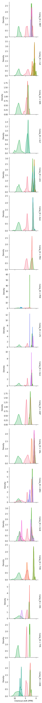
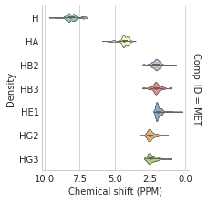
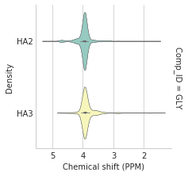
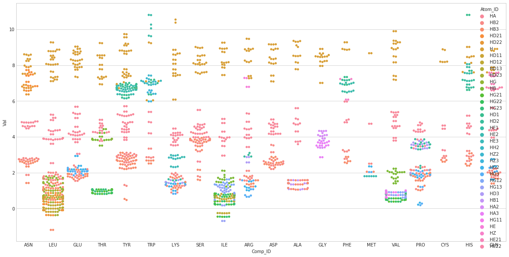

# Generating distribution maps of the chemical shifts in the BMRB protein NMR database

Author: Jonathan Bisson <bjo@uic.edu>

Licence: GNU GPL v3
    
You have to set PATH to a directory in which you downloaded http://www.bmrb.wisc.edu/ftp/pub/bmrb/relational_tables/nmr-star3.1/Atom_chem_shift.csv 

You need to have pandas, numpy, seaborn and matplotlib installed to be able to generate all the types of graphs

Thanks to the BMRB project:
"BioMagResBank", Eldon L. Ulrich; Hideo Akutsu; Jurgen F. Doreleijers; Yoko Harano; Yannis E. Ioannidis; Jundong Lin; Miron Livny; Steve Mading; Dimitri Maziuk; Zachary Miller; Eiichi Nakatani; Christopher F. Schulte; David E. Tolmie; R. Kent Wenger; Hongyang Yao; John L. Markley; Nucleic Acids Research 36, D402-D408 (2008) doi: 10.1093/nar/gkm957 

## Settings


```python
# Set this to the path where http://www.bmrb.wisc.edu/ftp/pub/bmrb/relational_tables/nmr-star3.1/Atom_chem_shift.csv is stored
PATH = "../data/www.bmrb.wisc.edu/ftp/pub/bmrb/relational_tables/nmr-star3.1/"
```

## Imports


```python
import pandas as pd
import seaborn as sns
import matplotlib.pyplot as plt
import numpy as np
import matplotlib as mpl
%matplotlib inline
```

## Loading and preparing data


```python
cs = pd.read_csv(PATH+'Atom_chem_shift.csv',
           usecols=['ID','Comp_ID', 'Atom_ID','Atom_type', 'Atom_isotope_number','Val','Val_err','Entry_ID'], engine='c')
```


```python
grouped_entry = cs.groupby(['Entry_ID'])#,'Atom_ID'])
grouped_comp = cs.groupby(['Comp_ID'])#,'Atom_ID'])
grouped_comp_atom = cs.groupby(['Comp_ID','Atom_ID'])
```


```python
def filter_percent(data, left=0.001, right=0.99999):
    """Filter the data to remove the outliers, we select values between /left/ and /right/ percentiles"""
    percentiles = [0.00001,0.0001,0.001,0.01,0.99,0.999,0.9999,0.99999]
    if left not in percentiles:
        raise ValueError('Left value must be in {}'.format(percentiles))
    if right not in percentiles:
        raise ValueError('Right value must be in {}'.format(percentiles))
    vals = dict(data.describe(percentiles=percentiles))
    
    return data[(data>
        vals['{0:f}'.format(100*left).rstrip('0')+'%']) & (data<vals['{0:f}'.format(100*right).rstrip('0')+'%'])]

```


```python
bilan = [["AminoAcid","Proton","Mean","Std","Count","DataType"]]
for name,group in grouped_comp_atom:
    dat = filter_percent(group.Val).describe()
    bilan.append([name[0],name[1], dat['mean'], dat['std'], dat['count'] ,"Filtered at 0.001%-99.999% of the values"])
```


```python
# Generating a common name 'aa_code'+'proton_code'
cs['mergedname'] = cs['Comp_ID'].map(str) + '-' + cs['Atom_ID'].map(str)
```


```python
# We only want the common amino acids
stdamino = ['ALA', 'ARG', 'ASP', 'ASN', 'CYS', 
            'GLN', 'GLU', 'GLY', 'HIS', 'ILE', 
            'LEU', 'LYS', 'MET', 'PHE', 'PRO', 
            'SER', 'THR', 'TRP', 'TYR', 'VAL']
data_h = cs[(cs.Atom_type=='H') & (cs.Comp_ID.isin(stdamino))]
```


```python
# Select the biggest proteins
biggest_prots = grouped_entry.count().sort_values('Atom_ID', ascending=False)
```


```python
# Removing the exchangables
forbiddenname = ['THR-HG1', 'SER-H', 'CYS-H', 'SER-HG', 'CYS-HG',
                'ASP-H', 'ASN-H', 'ASN-HD21', 'ASN-HD22',
                'GLU-H','GLN-H', 'GLN-HE21', 'GLN-HE22',
                'ARG-H', 'ARG-HE', 'ARG-H','GLY-H', 'TYR-HH',
                 'TRP-HE1', 'ARG-HH11', 'ARG-HH12', 'ARG-HH21', 'ARG-HH22',
                 'LYS-HZ1', 'LYS-HZ2', 'LYS-HZ3', 'PRO-H2', 'PRO-H3',
                 'ASP-HD2','GLU-HE2', 'HIS-HD1', 'HIS-HD2', 'HIS-HE1', 'HIS-HE2',
                'LYS-H','TRP-H','TYR-H', 'HIS-H']+[val+'-H' for val in stdamino]
                
data = data_h[(data_h.Entry_ID.isin(biggest_prots.index[0:200])) & 
          ~(data_h.mergedname.isin(forbiddenname))]

```

## Check the mean and std deviation of every proton


```python
N = 10
df_all = pd.DataFrame(bilan[1:],columns=bilan[0])
df_all[df_all.Count>N]
```


<div>
<style scoped>
    .dataframe tbody tr th:only-of-type {
        vertical-align: middle;
    }

    .dataframe tbody tr th {
        vertical-align: top;
    }

    .dataframe thead th {
        text-align: right;
    }
</style>
<table border="1" class="dataframe">
  <thead>
    <tr style="text-align: right;">
      <th></th>
      <th>AminoAcid</th>
      <th>Proton</th>
      <th>Mean</th>
      <th>Std</th>
      <th>Count</th>
      <th>DataType</th>
    </tr>
  </thead>
  <tbody>
    <tr>
      <th>7</th>
      <td>0AZ</td>
      <td>HA</td>
      <td>4.617462</td>
      <td>0.136053</td>
      <td>13.0</td>
      <td>Filtered at 0.001%-99.999% of the values</td>
    </tr>
    <tr>
      <th>8</th>
      <td>0AZ</td>
      <td>HB2</td>
      <td>2.261667</td>
      <td>0.171177</td>
      <td>12.0</td>
      <td>Filtered at 0.001%-99.999% of the values</td>
    </tr>
    <tr>
      <th>9</th>
      <td>0AZ</td>
      <td>HB3</td>
      <td>2.041615</td>
      <td>0.193685</td>
      <td>13.0</td>
      <td>Filtered at 0.001%-99.999% of the values</td>
    </tr>
    <tr>
      <th>10</th>
      <td>0AZ</td>
      <td>HD22</td>
      <td>3.762846</td>
      <td>0.207835</td>
      <td>13.0</td>
      <td>Filtered at 0.001%-99.999% of the values</td>
    </tr>
    <tr>
      <th>11</th>
      <td>0AZ</td>
      <td>HD23</td>
      <td>3.694462</td>
      <td>0.195536</td>
      <td>13.0</td>
      <td>Filtered at 0.001%-99.999% of the values</td>
    </tr>
    <tr>
      <th>12</th>
      <td>0AZ</td>
      <td>HG</td>
      <td>4.495167</td>
      <td>0.195672</td>
      <td>12.0</td>
      <td>Filtered at 0.001%-99.999% of the values</td>
    </tr>
    <tr>
      <th>31</th>
      <td>0UH</td>
      <td>H5'</td>
      <td>4.030000</td>
      <td>0.122766</td>
      <td>15.0</td>
      <td>Filtered at 0.001%-99.999% of the values</td>
    </tr>
    <tr>
      <th>812</th>
      <td>8OG</td>
      <td>H2'</td>
      <td>3.291489</td>
      <td>0.092237</td>
      <td>13.0</td>
      <td>Filtered at 0.001%-99.999% of the values</td>
    </tr>
    <tr>
      <th>813</th>
      <td>8OG</td>
      <td>H2''</td>
      <td>2.413883</td>
      <td>0.158867</td>
      <td>13.0</td>
      <td>Filtered at 0.001%-99.999% of the values</td>
    </tr>
    <tr>
      <th>899</th>
      <td>A</td>
      <td>C1'</td>
      <td>91.606396</td>
      <td>3.320239</td>
      <td>952.0</td>
      <td>Filtered at 0.001%-99.999% of the values</td>
    </tr>
    <tr>
      <th>900</th>
      <td>A</td>
      <td>C2</td>
      <td>152.038566</td>
      <td>7.153172</td>
      <td>1027.0</td>
      <td>Filtered at 0.001%-99.999% of the values</td>
    </tr>
    <tr>
      <th>901</th>
      <td>A</td>
      <td>C2'</td>
      <td>75.379969</td>
      <td>4.196029</td>
      <td>681.0</td>
      <td>Filtered at 0.001%-99.999% of the values</td>
    </tr>
    <tr>
      <th>902</th>
      <td>A</td>
      <td>C3'</td>
      <td>73.692789</td>
      <td>3.583341</td>
      <td>620.0</td>
      <td>Filtered at 0.001%-99.999% of the values</td>
    </tr>
    <tr>
      <th>903</th>
      <td>A</td>
      <td>C4</td>
      <td>147.817367</td>
      <td>1.535236</td>
      <td>30.0</td>
      <td>Filtered at 0.001%-99.999% of the values</td>
    </tr>
    <tr>
      <th>904</th>
      <td>A</td>
      <td>C4'</td>
      <td>82.654823</td>
      <td>2.349380</td>
      <td>606.0</td>
      <td>Filtered at 0.001%-99.999% of the values</td>
    </tr>
    <tr>
      <th>905</th>
      <td>A</td>
      <td>C5</td>
      <td>117.337467</td>
      <td>9.888154</td>
      <td>30.0</td>
      <td>Filtered at 0.001%-99.999% of the values</td>
    </tr>
    <tr>
      <th>906</th>
      <td>A</td>
      <td>C5'</td>
      <td>65.869155</td>
      <td>4.243190</td>
      <td>517.0</td>
      <td>Filtered at 0.001%-99.999% of the values</td>
    </tr>
    <tr>
      <th>907</th>
      <td>A</td>
      <td>C6</td>
      <td>155.790281</td>
      <td>2.954809</td>
      <td>32.0</td>
      <td>Filtered at 0.001%-99.999% of the values</td>
    </tr>
    <tr>
      <th>908</th>
      <td>A</td>
      <td>C8</td>
      <td>138.671054</td>
      <td>6.201623</td>
      <td>990.0</td>
      <td>Filtered at 0.001%-99.999% of the values</td>
    </tr>
    <tr>
      <th>909</th>
      <td>A</td>
      <td>H1'</td>
      <td>5.893535</td>
      <td>0.211265</td>
      <td>1575.0</td>
      <td>Filtered at 0.001%-99.999% of the values</td>
    </tr>
    <tr>
      <th>910</th>
      <td>A</td>
      <td>H2</td>
      <td>7.641034</td>
      <td>0.433307</td>
      <td>1589.0</td>
      <td>Filtered at 0.001%-99.999% of the values</td>
    </tr>
    <tr>
      <th>911</th>
      <td>A</td>
      <td>H2'</td>
      <td>4.589520</td>
      <td>0.222087</td>
      <td>1392.0</td>
      <td>Filtered at 0.001%-99.999% of the values</td>
    </tr>
    <tr>
      <th>912</th>
      <td>A</td>
      <td>H3'</td>
      <td>4.635036</td>
      <td>0.207328</td>
      <td>1196.0</td>
      <td>Filtered at 0.001%-99.999% of the values</td>
    </tr>
    <tr>
      <th>913</th>
      <td>A</td>
      <td>H4'</td>
      <td>4.470343</td>
      <td>0.166519</td>
      <td>1022.0</td>
      <td>Filtered at 0.001%-99.999% of the values</td>
    </tr>
    <tr>
      <th>915</th>
      <td>A</td>
      <td>H5'</td>
      <td>4.302490</td>
      <td>0.228790</td>
      <td>789.0</td>
      <td>Filtered at 0.001%-99.999% of the values</td>
    </tr>
    <tr>
      <th>916</th>
      <td>A</td>
      <td>H5''</td>
      <td>4.190562</td>
      <td>0.196608</td>
      <td>763.0</td>
      <td>Filtered at 0.001%-99.999% of the values</td>
    </tr>
    <tr>
      <th>917</th>
      <td>A</td>
      <td>H61</td>
      <td>7.496257</td>
      <td>0.771004</td>
      <td>296.0</td>
      <td>Filtered at 0.001%-99.999% of the values</td>
    </tr>
    <tr>
      <th>918</th>
      <td>A</td>
      <td>H62</td>
      <td>6.852890</td>
      <td>0.687450</td>
      <td>263.0</td>
      <td>Filtered at 0.001%-99.999% of the values</td>
    </tr>
    <tr>
      <th>919</th>
      <td>A</td>
      <td>H8</td>
      <td>8.020866</td>
      <td>0.278656</td>
      <td>1555.0</td>
      <td>Filtered at 0.001%-99.999% of the values</td>
    </tr>
    <tr>
      <th>920</th>
      <td>A</td>
      <td>HO2'</td>
      <td>6.057024</td>
      <td>1.063352</td>
      <td>41.0</td>
      <td>Filtered at 0.001%-99.999% of the values</td>
    </tr>
    <tr>
      <th>...</th>
      <td>...</td>
      <td>...</td>
      <td>...</td>
      <td>...</td>
      <td>...</td>
      <td>...</td>
    </tr>
    <tr>
      <th>6591</th>
      <td>U</td>
      <td>H1'</td>
      <td>5.612921</td>
      <td>0.249335</td>
      <td>1533.0</td>
      <td>Filtered at 0.001%-99.999% of the values</td>
    </tr>
    <tr>
      <th>6592</th>
      <td>U</td>
      <td>H2'</td>
      <td>4.370918</td>
      <td>0.238936</td>
      <td>1358.0</td>
      <td>Filtered at 0.001%-99.999% of the values</td>
    </tr>
    <tr>
      <th>6593</th>
      <td>U</td>
      <td>H3</td>
      <td>13.088543</td>
      <td>1.217873</td>
      <td>882.0</td>
      <td>Filtered at 0.001%-99.999% of the values</td>
    </tr>
    <tr>
      <th>6594</th>
      <td>U</td>
      <td>H3'</td>
      <td>4.482253</td>
      <td>0.184038</td>
      <td>1123.0</td>
      <td>Filtered at 0.001%-99.999% of the values</td>
    </tr>
    <tr>
      <th>6595</th>
      <td>U</td>
      <td>H4'</td>
      <td>4.367375</td>
      <td>0.196125</td>
      <td>946.0</td>
      <td>Filtered at 0.001%-99.999% of the values</td>
    </tr>
    <tr>
      <th>6596</th>
      <td>U</td>
      <td>H5</td>
      <td>5.476850</td>
      <td>0.304650</td>
      <td>1506.0</td>
      <td>Filtered at 0.001%-99.999% of the values</td>
    </tr>
    <tr>
      <th>6597</th>
      <td>U</td>
      <td>H5"</td>
      <td>4.400667</td>
      <td>0.105689</td>
      <td>12.0</td>
      <td>Filtered at 0.001%-99.999% of the values</td>
    </tr>
    <tr>
      <th>6598</th>
      <td>U</td>
      <td>H5'</td>
      <td>4.238452</td>
      <td>0.252673</td>
      <td>698.0</td>
      <td>Filtered at 0.001%-99.999% of the values</td>
    </tr>
    <tr>
      <th>6599</th>
      <td>U</td>
      <td>H5''</td>
      <td>4.160624</td>
      <td>0.248301</td>
      <td>694.0</td>
      <td>Filtered at 0.001%-99.999% of the values</td>
    </tr>
    <tr>
      <th>6600</th>
      <td>U</td>
      <td>H6</td>
      <td>7.749463</td>
      <td>0.198218</td>
      <td>1562.0</td>
      <td>Filtered at 0.001%-99.999% of the values</td>
    </tr>
    <tr>
      <th>6601</th>
      <td>U</td>
      <td>HO2'</td>
      <td>6.388528</td>
      <td>1.312322</td>
      <td>36.0</td>
      <td>Filtered at 0.001%-99.999% of the values</td>
    </tr>
    <tr>
      <th>6602</th>
      <td>U</td>
      <td>N1</td>
      <td>151.673303</td>
      <td>10.661504</td>
      <td>195.0</td>
      <td>Filtered at 0.001%-99.999% of the values</td>
    </tr>
    <tr>
      <th>6603</th>
      <td>U</td>
      <td>N3</td>
      <td>160.411970</td>
      <td>6.803381</td>
      <td>559.0</td>
      <td>Filtered at 0.001%-99.999% of the values</td>
    </tr>
    <tr>
      <th>6605</th>
      <td>U</td>
      <td>P</td>
      <td>-2.986389</td>
      <td>1.752817</td>
      <td>144.0</td>
      <td>Filtered at 0.001%-99.999% of the values</td>
    </tr>
    <tr>
      <th>6725</th>
      <td>UVR</td>
      <td>HA</td>
      <td>4.356538</td>
      <td>0.558075</td>
      <td>13.0</td>
      <td>Filtered at 0.001%-99.999% of the values</td>
    </tr>
    <tr>
      <th>6756</th>
      <td>VAL</td>
      <td>C</td>
      <td>175.690029</td>
      <td>1.880208</td>
      <td>40909.0</td>
      <td>Filtered at 0.001%-99.999% of the values</td>
    </tr>
    <tr>
      <th>6757</th>
      <td>VAL</td>
      <td>CA</td>
      <td>62.538574</td>
      <td>2.849034</td>
      <td>55764.0</td>
      <td>Filtered at 0.001%-99.999% of the values</td>
    </tr>
    <tr>
      <th>6758</th>
      <td>VAL</td>
      <td>CB</td>
      <td>32.748506</td>
      <td>2.058913</td>
      <td>51884.0</td>
      <td>Filtered at 0.001%-99.999% of the values</td>
    </tr>
    <tr>
      <th>6759</th>
      <td>VAL</td>
      <td>CG1</td>
      <td>21.544444</td>
      <td>1.925977</td>
      <td>37630.0</td>
      <td>Filtered at 0.001%-99.999% of the values</td>
    </tr>
    <tr>
      <th>6760</th>
      <td>VAL</td>
      <td>CG2</td>
      <td>21.340397</td>
      <td>2.032281</td>
      <td>36325.0</td>
      <td>Filtered at 0.001%-99.999% of the values</td>
    </tr>
    <tr>
      <th>6761</th>
      <td>VAL</td>
      <td>H</td>
      <td>8.280674</td>
      <td>0.674317</td>
      <td>62790.0</td>
      <td>Filtered at 0.001%-99.999% of the values</td>
    </tr>
    <tr>
      <th>6762</th>
      <td>VAL</td>
      <td>HA</td>
      <td>4.171796</td>
      <td>0.580150</td>
      <td>46708.0</td>
      <td>Filtered at 0.001%-99.999% of the values</td>
    </tr>
    <tr>
      <th>6763</th>
      <td>VAL</td>
      <td>HB</td>
      <td>1.981703</td>
      <td>0.323501</td>
      <td>43731.0</td>
      <td>Filtered at 0.001%-99.999% of the values</td>
    </tr>
    <tr>
      <th>6764</th>
      <td>VAL</td>
      <td>HG11</td>
      <td>0.822675</td>
      <td>0.273189</td>
      <td>43611.0</td>
      <td>Filtered at 0.001%-99.999% of the values</td>
    </tr>
    <tr>
      <th>6765</th>
      <td>VAL</td>
      <td>HG12</td>
      <td>0.822611</td>
      <td>0.273272</td>
      <td>43611.0</td>
      <td>Filtered at 0.001%-99.999% of the values</td>
    </tr>
    <tr>
      <th>6766</th>
      <td>VAL</td>
      <td>HG13</td>
      <td>0.822606</td>
      <td>0.273312</td>
      <td>43611.0</td>
      <td>Filtered at 0.001%-99.999% of the values</td>
    </tr>
    <tr>
      <th>6767</th>
      <td>VAL</td>
      <td>HG21</td>
      <td>0.802325</td>
      <td>0.312284</td>
      <td>42830.0</td>
      <td>Filtered at 0.001%-99.999% of the values</td>
    </tr>
    <tr>
      <th>6768</th>
      <td>VAL</td>
      <td>HG22</td>
      <td>0.802294</td>
      <td>0.312296</td>
      <td>42830.0</td>
      <td>Filtered at 0.001%-99.999% of the values</td>
    </tr>
    <tr>
      <th>6769</th>
      <td>VAL</td>
      <td>HG23</td>
      <td>0.802280</td>
      <td>0.312307</td>
      <td>42830.0</td>
      <td>Filtered at 0.001%-99.999% of the values</td>
    </tr>
    <tr>
      <th>6770</th>
      <td>VAL</td>
      <td>N</td>
      <td>121.231507</td>
      <td>7.549756</td>
      <td>59798.0</td>
      <td>Filtered at 0.001%-99.999% of the values</td>
    </tr>
  </tbody>
</table>
<p>693 rows × 6 columns</p>
</div>


## Show the biggest proteins


```python
biggest_prots
```


<div>
<style scoped>
    .dataframe tbody tr th:only-of-type {
        vertical-align: middle;
    }

    .dataframe tbody tr th {
        vertical-align: top;
    }

    .dataframe thead th {
        text-align: right;
    }
</style>
<table border="1" class="dataframe">
  <thead>
    <tr style="text-align: right;">
      <th></th>
      <th>ID</th>
      <th>Comp_ID</th>
      <th>Atom_ID</th>
      <th>Atom_type</th>
      <th>Atom_isotope_number</th>
      <th>Val</th>
      <th>Val_err</th>
      <th>mergedname</th>
    </tr>
    <tr>
      <th>Entry_ID</th>
      <th></th>
      <th></th>
      <th></th>
      <th></th>
      <th></th>
      <th></th>
      <th></th>
      <th></th>
    </tr>
  </thead>
  <tbody>
    <tr>
      <th>18857</th>
      <td>21514</td>
      <td>21514</td>
      <td>21514</td>
      <td>21514</td>
      <td>21514</td>
      <td>21514</td>
      <td>21514</td>
      <td>21514</td>
    </tr>
    <tr>
      <th>30080</th>
      <td>6416</td>
      <td>6416</td>
      <td>6416</td>
      <td>6416</td>
      <td>6416</td>
      <td>6416</td>
      <td>6416</td>
      <td>6416</td>
    </tr>
    <tr>
      <th>30086</th>
      <td>5202</td>
      <td>5202</td>
      <td>5202</td>
      <td>5202</td>
      <td>5202</td>
      <td>5202</td>
      <td>5202</td>
      <td>5202</td>
    </tr>
    <tr>
      <th>4264</th>
      <td>5105</td>
      <td>5105</td>
      <td>5105</td>
      <td>5105</td>
      <td>5105</td>
      <td>5105</td>
      <td>5105</td>
      <td>5105</td>
    </tr>
    <tr>
      <th>30081</th>
      <td>5090</td>
      <td>5090</td>
      <td>5090</td>
      <td>5090</td>
      <td>5090</td>
      <td>5090</td>
      <td>5090</td>
      <td>5090</td>
    </tr>
    <tr>
      <th>30083</th>
      <td>5078</td>
      <td>5078</td>
      <td>5078</td>
      <td>5078</td>
      <td>5078</td>
      <td>5078</td>
      <td>5078</td>
      <td>5078</td>
    </tr>
    <tr>
      <th>30084</th>
      <td>5054</td>
      <td>5054</td>
      <td>5054</td>
      <td>5054</td>
      <td>5054</td>
      <td>5054</td>
      <td>5054</td>
      <td>5054</td>
    </tr>
    <tr>
      <th>16632</th>
      <td>4978</td>
      <td>4978</td>
      <td>4978</td>
      <td>4978</td>
      <td>4978</td>
      <td>4978</td>
      <td>4978</td>
      <td>4978</td>
    </tr>
    <tr>
      <th>30082</th>
      <td>4940</td>
      <td>4940</td>
      <td>4940</td>
      <td>4940</td>
      <td>4940</td>
      <td>4940</td>
      <td>4940</td>
      <td>4940</td>
    </tr>
    <tr>
      <th>30085</th>
      <td>4726</td>
      <td>4726</td>
      <td>4726</td>
      <td>4726</td>
      <td>4726</td>
      <td>4726</td>
      <td>4726</td>
      <td>4726</td>
    </tr>
    <tr>
      <th>19135</th>
      <td>4675</td>
      <td>4675</td>
      <td>4675</td>
      <td>4675</td>
      <td>4675</td>
      <td>4675</td>
      <td>4675</td>
      <td>4675</td>
    </tr>
    <tr>
      <th>7114</th>
      <td>4389</td>
      <td>4389</td>
      <td>4389</td>
      <td>4389</td>
      <td>4389</td>
      <td>4389</td>
      <td>4389</td>
      <td>4389</td>
    </tr>
    <tr>
      <th>16481</th>
      <td>4286</td>
      <td>4286</td>
      <td>4286</td>
      <td>4286</td>
      <td>4286</td>
      <td>4286</td>
      <td>4286</td>
      <td>4286</td>
    </tr>
    <tr>
      <th>25242</th>
      <td>4285</td>
      <td>4285</td>
      <td>4285</td>
      <td>4285</td>
      <td>4285</td>
      <td>4285</td>
      <td>4285</td>
      <td>4285</td>
    </tr>
    <tr>
      <th>19219</th>
      <td>4165</td>
      <td>4165</td>
      <td>4165</td>
      <td>4165</td>
      <td>4165</td>
      <td>4165</td>
      <td>4165</td>
      <td>4165</td>
    </tr>
    <tr>
      <th>19047</th>
      <td>4074</td>
      <td>4074</td>
      <td>4074</td>
      <td>4074</td>
      <td>4074</td>
      <td>4074</td>
      <td>4074</td>
      <td>4074</td>
    </tr>
    <tr>
      <th>19048</th>
      <td>4041</td>
      <td>4041</td>
      <td>4041</td>
      <td>4041</td>
      <td>4041</td>
      <td>4041</td>
      <td>4041</td>
      <td>4041</td>
    </tr>
    <tr>
      <th>17771</th>
      <td>3997</td>
      <td>3997</td>
      <td>3997</td>
      <td>3997</td>
      <td>3997</td>
      <td>3997</td>
      <td>3997</td>
      <td>3997</td>
    </tr>
    <tr>
      <th>5688</th>
      <td>3976</td>
      <td>3976</td>
      <td>3976</td>
      <td>3976</td>
      <td>3976</td>
      <td>3976</td>
      <td>3976</td>
      <td>3976</td>
    </tr>
    <tr>
      <th>15912</th>
      <td>3936</td>
      <td>3936</td>
      <td>3936</td>
      <td>3936</td>
      <td>3936</td>
      <td>3936</td>
      <td>3936</td>
      <td>3936</td>
    </tr>
    <tr>
      <th>16809</th>
      <td>3776</td>
      <td>3776</td>
      <td>3776</td>
      <td>3776</td>
      <td>3776</td>
      <td>3776</td>
      <td>3776</td>
      <td>3776</td>
    </tr>
    <tr>
      <th>15578</th>
      <td>3693</td>
      <td>3693</td>
      <td>3693</td>
      <td>3693</td>
      <td>3693</td>
      <td>3693</td>
      <td>3693</td>
      <td>3693</td>
    </tr>
    <tr>
      <th>18632</th>
      <td>3550</td>
      <td>3550</td>
      <td>3550</td>
      <td>3550</td>
      <td>3550</td>
      <td>3550</td>
      <td>3550</td>
      <td>3550</td>
    </tr>
    <tr>
      <th>16715</th>
      <td>3545</td>
      <td>3545</td>
      <td>3545</td>
      <td>3545</td>
      <td>3545</td>
      <td>3545</td>
      <td>3545</td>
      <td>3545</td>
    </tr>
    <tr>
      <th>16738</th>
      <td>3545</td>
      <td>3545</td>
      <td>3545</td>
      <td>3545</td>
      <td>3545</td>
      <td>3545</td>
      <td>3545</td>
      <td>3545</td>
    </tr>
    <tr>
      <th>17250</th>
      <td>3395</td>
      <td>3395</td>
      <td>3395</td>
      <td>3395</td>
      <td>3395</td>
      <td>3395</td>
      <td>3395</td>
      <td>3395</td>
    </tr>
    <tr>
      <th>17416</th>
      <td>3382</td>
      <td>3382</td>
      <td>3382</td>
      <td>3382</td>
      <td>3382</td>
      <td>3382</td>
      <td>3382</td>
      <td>3382</td>
    </tr>
    <tr>
      <th>5471</th>
      <td>3354</td>
      <td>3354</td>
      <td>3354</td>
      <td>3354</td>
      <td>3354</td>
      <td>3354</td>
      <td>3354</td>
      <td>3354</td>
    </tr>
    <tr>
      <th>19491</th>
      <td>3347</td>
      <td>3347</td>
      <td>3347</td>
      <td>3347</td>
      <td>3347</td>
      <td>3347</td>
      <td>3347</td>
      <td>3347</td>
    </tr>
    <tr>
      <th>4311</th>
      <td>3325</td>
      <td>3325</td>
      <td>3325</td>
      <td>3325</td>
      <td>3325</td>
      <td>3325</td>
      <td>3325</td>
      <td>3325</td>
    </tr>
    <tr>
      <th>...</th>
      <td>...</td>
      <td>...</td>
      <td>...</td>
      <td>...</td>
      <td>...</td>
      <td>...</td>
      <td>...</td>
      <td>...</td>
    </tr>
    <tr>
      <th>123</th>
      <td>1</td>
      <td>1</td>
      <td>1</td>
      <td>1</td>
      <td>1</td>
      <td>1</td>
      <td>0</td>
      <td>1</td>
    </tr>
    <tr>
      <th>1108</th>
      <td>1</td>
      <td>1</td>
      <td>1</td>
      <td>1</td>
      <td>1</td>
      <td>1</td>
      <td>0</td>
      <td>1</td>
    </tr>
    <tr>
      <th>1822</th>
      <td>1</td>
      <td>1</td>
      <td>1</td>
      <td>1</td>
      <td>1</td>
      <td>1</td>
      <td>0</td>
      <td>1</td>
    </tr>
    <tr>
      <th>1117</th>
      <td>1</td>
      <td>1</td>
      <td>1</td>
      <td>1</td>
      <td>1</td>
      <td>1</td>
      <td>0</td>
      <td>1</td>
    </tr>
    <tr>
      <th>562</th>
      <td>1</td>
      <td>1</td>
      <td>1</td>
      <td>1</td>
      <td>1</td>
      <td>1</td>
      <td>0</td>
      <td>1</td>
    </tr>
    <tr>
      <th>563</th>
      <td>1</td>
      <td>1</td>
      <td>1</td>
      <td>1</td>
      <td>1</td>
      <td>1</td>
      <td>0</td>
      <td>1</td>
    </tr>
    <tr>
      <th>1056</th>
      <td>1</td>
      <td>1</td>
      <td>1</td>
      <td>1</td>
      <td>1</td>
      <td>1</td>
      <td>0</td>
      <td>1</td>
    </tr>
    <tr>
      <th>1053</th>
      <td>1</td>
      <td>1</td>
      <td>1</td>
      <td>1</td>
      <td>1</td>
      <td>1</td>
      <td>0</td>
      <td>1</td>
    </tr>
    <tr>
      <th>2229</th>
      <td>1</td>
      <td>1</td>
      <td>1</td>
      <td>1</td>
      <td>1</td>
      <td>1</td>
      <td>0</td>
      <td>1</td>
    </tr>
    <tr>
      <th>2235</th>
      <td>1</td>
      <td>1</td>
      <td>1</td>
      <td>1</td>
      <td>1</td>
      <td>1</td>
      <td>0</td>
      <td>1</td>
    </tr>
    <tr>
      <th>2236</th>
      <td>1</td>
      <td>1</td>
      <td>1</td>
      <td>1</td>
      <td>1</td>
      <td>1</td>
      <td>0</td>
      <td>1</td>
    </tr>
    <tr>
      <th>1158</th>
      <td>1</td>
      <td>1</td>
      <td>1</td>
      <td>1</td>
      <td>1</td>
      <td>1</td>
      <td>0</td>
      <td>1</td>
    </tr>
    <tr>
      <th>877</th>
      <td>1</td>
      <td>1</td>
      <td>1</td>
      <td>1</td>
      <td>1</td>
      <td>1</td>
      <td>0</td>
      <td>1</td>
    </tr>
    <tr>
      <th>468</th>
      <td>1</td>
      <td>1</td>
      <td>1</td>
      <td>1</td>
      <td>1</td>
      <td>1</td>
      <td>1</td>
      <td>1</td>
    </tr>
    <tr>
      <th>469</th>
      <td>1</td>
      <td>1</td>
      <td>1</td>
      <td>1</td>
      <td>1</td>
      <td>1</td>
      <td>1</td>
      <td>1</td>
    </tr>
    <tr>
      <th>25236</th>
      <td>1</td>
      <td>1</td>
      <td>1</td>
      <td>1</td>
      <td>1</td>
      <td>1</td>
      <td>1</td>
      <td>1</td>
    </tr>
    <tr>
      <th>2285</th>
      <td>1</td>
      <td>1</td>
      <td>1</td>
      <td>1</td>
      <td>1</td>
      <td>1</td>
      <td>0</td>
      <td>1</td>
    </tr>
    <tr>
      <th>753</th>
      <td>1</td>
      <td>1</td>
      <td>1</td>
      <td>1</td>
      <td>1</td>
      <td>1</td>
      <td>0</td>
      <td>1</td>
    </tr>
    <tr>
      <th>2592</th>
      <td>1</td>
      <td>1</td>
      <td>1</td>
      <td>1</td>
      <td>1</td>
      <td>1</td>
      <td>0</td>
      <td>1</td>
    </tr>
    <tr>
      <th>2591</th>
      <td>1</td>
      <td>1</td>
      <td>1</td>
      <td>1</td>
      <td>1</td>
      <td>1</td>
      <td>0</td>
      <td>1</td>
    </tr>
    <tr>
      <th>2590</th>
      <td>1</td>
      <td>1</td>
      <td>1</td>
      <td>1</td>
      <td>1</td>
      <td>1</td>
      <td>0</td>
      <td>1</td>
    </tr>
    <tr>
      <th>2574</th>
      <td>1</td>
      <td>1</td>
      <td>1</td>
      <td>1</td>
      <td>1</td>
      <td>1</td>
      <td>0</td>
      <td>1</td>
    </tr>
    <tr>
      <th>662</th>
      <td>1</td>
      <td>1</td>
      <td>1</td>
      <td>1</td>
      <td>1</td>
      <td>1</td>
      <td>0</td>
      <td>1</td>
    </tr>
    <tr>
      <th>614</th>
      <td>1</td>
      <td>1</td>
      <td>1</td>
      <td>1</td>
      <td>1</td>
      <td>1</td>
      <td>0</td>
      <td>1</td>
    </tr>
    <tr>
      <th>452</th>
      <td>1</td>
      <td>1</td>
      <td>1</td>
      <td>1</td>
      <td>1</td>
      <td>1</td>
      <td>1</td>
      <td>1</td>
    </tr>
    <tr>
      <th>1042</th>
      <td>1</td>
      <td>1</td>
      <td>1</td>
      <td>1</td>
      <td>1</td>
      <td>1</td>
      <td>0</td>
      <td>1</td>
    </tr>
    <tr>
      <th>1043</th>
      <td>1</td>
      <td>1</td>
      <td>1</td>
      <td>1</td>
      <td>1</td>
      <td>1</td>
      <td>0</td>
      <td>1</td>
    </tr>
    <tr>
      <th>1044</th>
      <td>1</td>
      <td>1</td>
      <td>1</td>
      <td>1</td>
      <td>1</td>
      <td>1</td>
      <td>0</td>
      <td>1</td>
    </tr>
    <tr>
      <th>1045</th>
      <td>1</td>
      <td>1</td>
      <td>1</td>
      <td>1</td>
      <td>1</td>
      <td>1</td>
      <td>0</td>
      <td>1</td>
    </tr>
    <tr>
      <th>560</th>
      <td>1</td>
      <td>1</td>
      <td>1</td>
      <td>1</td>
      <td>1</td>
      <td>1</td>
      <td>0</td>
      <td>1</td>
    </tr>
  </tbody>
</table>
<p>10949 rows × 8 columns</p>
</div>


## Plotting the distributions of each proton of each amino acid


```python
def cond_dist_plot(val, *args,**kwargs):
    """A conditional dist plot that requires more than 1 value in the dataset"""
    if len(val)>1:
        try:
            return sns.distplot(val, *args,**kwargs)
        except ValueError:
            print(val)
    else:
        return None
def plot_all_cs_entry(entry_data):
    """Plot the distribution of all the atoms grouped by amino acid"""
    di = entry_data[ (entry_data.Atom_type=="H")]
    g = sns.FacetGrid(di, hue="Atom_ID", row='Comp_ID', margin_titles=True, sharey=False)
    
    g = g.map(cond_dist_plot,"Val",hist=False,  kde_kws={"shade": True}, norm_hist=True)
    g.set_axis_labels("Chemical shift (PPM)", "Density")
    plt.gca().invert_xaxis()
```


```python
plot_all_cs_entry(grouped_entry.get_group(4264))
```

    /home/bjo/anaconda3/lib/python3.6/site-packages/statsmodels/nonparametric/kde.py:494: RuntimeWarning: invalid value encountered in true_divide
      binned = fast_linbin(X,a,b,gridsize)/(delta*nobs)
    /home/bjo/anaconda3/lib/python3.6/site-packages/statsmodels/nonparametric/kdetools.py:34: RuntimeWarning: invalid value encountered in double_scalars
      FAC1 = 2*(np.pi*bw/RANGE)**2





## How to access specific chemical shifts of a specific amino acid in a specific protein


```python
ent = grouped_entry.get_group(4264)
ent[(ent.Comp_ID=='MET') & (ent.Atom_type=='H')].groupby('Atom_ID').Val.min()
```


    Atom_ID
    H      7.27
    HA     4.00
    HB2    2.04
    HB3    1.58
    HE1    1.94
    HE2    1.94
    HE3    1.94
    HG2    2.46
    HG3    1.94
    Name: Val, dtype: float64


```python
ent[(ent.Comp_ID=='MET') & (ent.Atom_type=='H')].groupby('Atom_ID').Val.max()
```


    Atom_ID
    H      8.46
    HA     4.76
    HB2    2.26
    HB3    2.24
    HE1    2.19
    HE2    2.19
    HE3    2.19
    HG2    2.46
    HG3    2.53
    Name: Val, dtype: float64


## Violin plots of each proton in each selected amino acid
Set the amino acids and atoms you wish to see in *aminos_to_consider*


```python
# We are only considering these amino acids for MET and GLY (some proteins have other designations)

aminos_to_consider = {
    'MET':['H', 'HA', 'HB2',
          'HB3', 'HE1','HG2',
          'HG3'],
    'GLY':['HA2', 'HA3']
}
```


```python
sns.set_style("whitegrid")
for amino in aminos_to_consider:
    selected = cs[(cs.Atom_type=='H') & (cs.Comp_ID==amino) & (cs.Entry_ID.isin(biggest_prots.index[0:20]))
             & (cs.Atom_ID.isin(aminos_to_consider[amino]))]
    
    g = sns.FacetGrid(selected, hue="Atom_ID", row='Comp_ID', margin_titles=True, sharey=False)
    g=g.map(sns.violinplot, y='Atom_ID', x='Val', data = selected, 
                   palette="Set3", bw=0.25, cut=1, linewidth=0.5,
                  orient='h')
    
    g.set_axis_labels("Chemical shift (PPM)", "Density")
    plt.gca().invert_xaxis()
```

    /home/bjo/anaconda3/lib/python3.6/site-packages/seaborn/axisgrid.py:703: UserWarning: Using the violinplot function without specifying `order` is likely to produce an incorrect plot.
      warnings.warn(warning)








## Plot the distribution of the different atoms in a single protein

We can now start having an idea of the distributions in a specific protein in a swarplot


```python
proteins_to_consider = biggest_prots.index[20:21]
plt.figure(figsize=(20,10))
sns.swarmplot(x='Comp_ID', y='Val', hue='Atom_ID', 
              data=cs[(cs.Atom_type=='H') & (cs.Entry_ID.isin(proteins_to_consider))])
```


    <matplotlib.axes._subplots.AxesSubplot at 0x7f094b332668>





## Generating the bar plots for each of the amino-acids and each of their signals


```python
plt.figure(figsize=(20,10))

for amino in stdamino:
    fig=plt.figure(figsize=(40,2), frameon=False)
    seldata = data[data.Comp_ID==amino]
    ax=sns.stripplot('Val', 'Atom_ID', 'Atom_ID' ,
                        data=seldata,
                        palette="Set2", size=100/len(seldata.Atom_ID.drop_duplicates()), marker='s',
                         alpha=.25,
                        jitter=False,
                        dodge=False,
                     linewidth=0,
                       orient='h' )

    plt.gca().invert_xaxis()
    plt.xlim(8.25,0.5)
    ax.grid(False)
    ax.axis('off')
    ax.legend().set_visible(False)
    ax.get_xaxis().set_visible(False)
    ax.get_yaxis().set_visible(False)
    ax.patch.set_visible(False)

    plt.savefig('data/{}_distr_0_200_top_no_xch.png'.format(amino), transparent=True, bbox_inches='tight')
```

    /home/bjo/anaconda3/lib/python3.6/site-packages/matplotlib/pyplot.py:537: RuntimeWarning: More than 20 figures have been opened. Figures created through the pyplot interface (`matplotlib.pyplot.figure`) are retained until explicitly closed and may consume too much memory. (To control this warning, see the rcParam `figure.max_open_warning`).
      max_open_warning, RuntimeWarning)


    <Figure size 1440x720 with 0 Axes>


